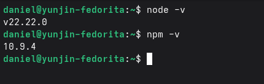

# Tips para tu interfaz gráfica


primero te comparto cómo instalé Vite / NPM

### Paso

En la terminal pon: 

```bash
node -v
npm -v
```

esto para que verifiques si tienes instalado node y npm
Si te arroja algo como que no los encuentra, instalalos con:

```bash
sudo dnf install -y nodejs npm
```
y vuelves a verificar con los comandos de arriba. Te debería aparecer así:



---

### Paso 2

En tu consola crea el directorio: 

```bash
mkdir gui-procesos
cd gui-procesos
```
Y ahora crea el proyecto en tu carpeta

```bash
npm create vite@latest . -- --template vanilla
```

muy probablemente te va a pedir que instales dependencias, te va a pedir confirmación, si no usa: 

```bash
npm install
```
---

### Paso 3

dentro de esta carpeta haces un `ls` y deberías de ver varios archivos como:

```bash
index.html
package.json
package-lock.json
node_modules/
public/
src/
```
y dentro del último, en `src` deberías de ver:

```bash
main.js
style.css
```


Los 3 importantes son:

```bash
main.js
style.css
index.html
```
porque son los que vas a modificar desde tu editor de preferencia. 

---

### Paso 4

Aquí vas a editar los archivos que te mencioné antes, en estos puedes pedirle a una IA como chat o Gemini que te genere scripts para estos tres, de igual manera de comparto los míos por si te quieres dar una idea:

`index.html`

```html
<!doctype html>
<html lang="es">
  <head>
    <meta charset="UTF-8" />
    <meta name="viewport" content="width=device-width, initial-scale=1.0" />
    <title>Gestión de Procesos</title>
  </head>
  <body>
    <div class="app">
      <header class="card header">
        <h1>Gestión de Procesos</h1>
        <p class="muted">Interfaz para administrar servidores.</p>
      </header>

      <section class="grid">
        <div class="card">
          <h2>Servidores</h2>

          <div class="row">
            <label>Modo</label>
            <select id="mode">
              <option value="mock">Mock</option>
              <option value="api">API real</option>
            </select>
          </div>

          <div class="row">
            <label>URL API</label>
            <input id="baseUrl" placeholder="http://localhost:9000" value="http://localhost:9000" />
          </div>

          <div class="row">
            <label>Servidor</label>
            <select id="serverSelect"></select>
          </div>

          <div class="actions">
            <button id="btnDiscover">Descubrir</button>
            <button id="btnRefresh">Actualizar procesos</button>
            <button id="btnMetrics">Métricas</button>
          </div>

          <div class="status">
            <span id="statusDot" class="dot"></span>
            <span id="statusText">Listo</span>
          </div>
        </div>

        <div class="card">
          <h2>Procesos</h2>

          <div class="row">
            <label>Buscar</label>
            <input id="search" placeholder="filtrar por nombre o PID..." />
          </div>

          <div class="tableWrap">
            <table>
              <thead>
                <tr>
                  <th>PID</th>
                  <th>Nombre</th>
                  <th>Estado</th>
                  <th>CPU %</th>
                  <th>RAM</th>
                </tr>
              </thead>
              <tbody id="procBody"></tbody>
            </table>
          </div>

          <div class="actions">
            <button id="btnStart">Iniciar</button>
            <button id="btnStop" class="danger">Detener</button>
            <input id="startName" placeholder="nombre del proceso (ej. chrome)" />
          </div>

          <p class="muted">Selecciona un proceso a detener.</p>
        </div>
      </section>

      <section class="card">
        <h2>Actualizaciones</h2>
        <pre id="logs" class="logs"></pre>
      </section>
    </div>

    <script type="module" src="/src/main.js"></script>
  </body>
</html>
```

---

`style.css`

```css
/* 1) Base: evita desbordes por padding */
* { box-sizing: border-box; }

:root{
  /* Paleta recomendada (dark azul, no negro apagado) */
  --bg: #0f172a;          /* fondo */
  --card: #1e293b;        /* recuadros */
  --card2: #172a46;       /* hover/variación */
  --border: #334155;      /* bordes */
  --text: #f1f5f9;        /* texto principal */
  --muted: #94a3b8;       /* texto secundario */

  --primary: #3b82f6;     /* botones principales */
  --danger: #ef4444;      /* acciones peligrosas */
  --ok: #22c55e;          /* estado ok */
  --warn: #f59e0b;        /* estado busy */
  --idle: #6b7280;        /* estado idle */
}

body{
  margin: 0;
  font-family: system-ui, Arial, sans-serif;
  background: radial-gradient(1200px 600px at 20% 0%, #13244a 0%, var(--bg) 55%);
  color: var(--text);
}

.app{
  max-width: 1200px;
  margin: 32px auto;
  padding: 0 16px;
}

/* Cards */
.card{
  background: linear-gradient(180deg, rgba(255,255,255,0.03), rgba(0,0,0,0.06));
  background-color: var(--card);
  border: 1px solid var(--border);
  border-radius: 16px;
  padding: 20px;
  box-shadow: 0 10px 40px rgba(0,0,0,0.30);
  width: 100%;
}

/* Header card */
.header{
  margin-bottom: 22px;
}

h1, h2{
  margin: 0 0 10px;
  letter-spacing: 0.2px;
}

.muted{
  color: var(--muted);
  margin: 6px 0 0;
}

/* Grid principal */
.grid{
  display: grid;
  grid-template-columns: 1fr 2fr;
  gap: 28px;              /* separación entre recuadros */
  align-items: stretch;   /* evita que se vean “salidos” */
  margin-bottom: 22px;
}

/* Filas label + input */
.row{
  display: grid;
  grid-template-columns: 140px 1fr;
  gap: 10px;
  align-items: center;
  margin: 10px 0;
}

input, select{
  width: 100%;
  padding: 10px 12px;
  border-radius: 12px;
  border: 1px solid var(--border);
  background: rgba(15, 23, 42, 0.55);
  color: var(--text);
  outline: none;
}

input:focus, select:focus{
  border-color: rgba(59,130,246,0.8);
  box-shadow: 0 0 0 3px rgba(59,130,246,0.20);
}

/* Botones */
.actions{
  display: flex;
  gap: 10px;
  flex-wrap: wrap;
  margin-top: 12px;
}

button{
  padding: 10px 12px;
  border-radius: 12px;
  border: 1px solid var(--border);
  background: rgba(59,130,246,0.12);
  color: var(--text);
  cursor: pointer;
  transition: transform 120ms ease, filter 120ms ease;
}

button:hover{
  filter: brightness(1.12);
  transform: translateY(-1px);
}

button.danger{
  background: rgba(239,68,68,0.12);
  border-color: rgba(239,68,68,0.35);
}

button:disabled{
  opacity: 0.55;
  cursor: not-allowed;
  transform: none;
}

/* Estado */
.status{
  display: flex;
  gap: 10px;
  align-items: center;
  margin-top: 14px;
}

.dot{
  width: 10px;
  height: 10px;
  border-radius: 999px;
  background: var(--idle);
  display: inline-block;
}

/* Tabla */
.tableWrap{
  overflow: auto; /* si se reduce pantalla, evita que se “salga” */
  border-radius: 12px;
  border: 1px solid rgba(51,65,85,0.35);
}

table{
  width: 100%;
  border-collapse: collapse;
  min-width: 560px;
}

th, td{
  padding: 12px 12px;
  border-bottom: 1px solid rgba(51,65,85,0.35);
  text-align: left;
}

thead th{
  background: rgba(15, 23, 42, 0.45);
}

tbody tr{
  cursor: pointer;
}

tbody tr:hover{
  background: rgba(59,130,246,0.08);
}

tbody tr.selected{
  outline: 2px solid rgba(59,130,246,0.85);
  outline-offset: -2px;
}

/* Logs */
.logs{
  background: rgba(15, 23, 42, 0.55);
  border: 1px solid rgba(51,65,85,0.55);
  border-radius: 12px;
  padding: 12px;
  min-height: 140px;
  overflow: auto;
  white-space: pre-wrap;
}


@media (max-width: 900px){
  .grid{ grid-template-columns: 1fr; }
  .row{ grid-template-columns: 1fr; }
  table{ min-width: 0; }
}
```

---

`src/main.js`

```javascript
import "./style.css";

const els = {
  mode: document.getElementById("mode"),
  baseUrl: document.getElementById("baseUrl"),
  serverSelect: document.getElementById("serverSelect"),
  btnDiscover: document.getElementById("btnDiscover"),
  btnRefresh: document.getElementById("btnRefresh"),
  btnMetrics: document.getElementById("btnMetrics"),
  btnStart: document.getElementById("btnStart"),
  btnStop: document.getElementById("btnStop"),
  startName: document.getElementById("startName"),
  procBody: document.getElementById("procBody"),
  search: document.getElementById("search"),
  logs: document.getElementById("logs"),
  statusDot: document.getElementById("statusDot"),
  statusText: document.getElementById("statusText"),
};

let servers = [];
let processes = [];
let selectedPid = null;

function log(msg) {
  const ts = new Date().toLocaleTimeString();
  els.logs.textContent += `[${ts}] ${msg}\n`;
  els.logs.scrollTop = els.logs.scrollHeight;
}

function setStatus(state, text) {
  // state: idle | ok | busy | err
  const map = {
    idle: getCss("--idle"),
    ok: getCss("--ok"),
    busy: getCss("--warn"),
    err: getCss("--danger"),
  };
  els.statusDot.style.background = map[state] ?? map.idle;
  els.statusText.textContent = text;
}

function getCss(varName) {
  return getComputedStyle(document.documentElement).getPropertyValue(varName).trim();
}

function getSelectedServer() {
  const idx = els.serverSelect.selectedIndex;
  return servers[idx] ?? null;
}

/* -------------------- MODO MOCK -------------------- */
function mockDiscover() {
  return [
    { alias: "Server-A", ip: "192.168.1.10", port: 9000 },
    { alias: "Server-B", ip: "192.168.1.11", port: 9000 },
  ];
}

function mockList() {
  return [
    { pid: 1201, name: "nginx", status: "RUNNING", cpu: 0.6, ram: 55 },
    { pid: 2202, name: "postgres", status: "RUNNING", cpu: 1.8, ram: 320 },
    { pid: 3303, name: "worker", status: "STOPPED", cpu: 0.0, ram: 0 },
  ];
}

function mockStart(name) {
  return { ok: true, message: `Proceso "${name}" iniciado (mock)` };
}

function mockStop(pid) {
  return { ok: true, message: `Proceso PID ${pid} detenido (mock)` };
}

function mockMetrics() {
  return { ok: true, data: { cpuTotal: 12.4, ramTotal: 43.2, uptime: "3h 22m" } };
}

async function apiGet(path) {
  const base = els.baseUrl.value.trim().replace(/\/$/, "");
  const url = `${base}${path}`;
  const res = await fetch(url);
  if (!res.ok) throw new Error(`HTTP ${res.status} en ${path}`);
  return await res.json();
}

async function apiPost(path, body) {
  const base = els.baseUrl.value.trim().replace(/\/$/, "");
  const url = `${base}${path}`;
  const res = await fetch(url, {
    method: "POST",
    headers: { "Content-Type": "application/json" },
    body: JSON.stringify(body ?? {}),
  });
  if (!res.ok) throw new Error(`HTTP ${res.status} en ${path}`);
  return await res.json();
}

/* -------------------- Render -------------------- */
function renderServers() {
  els.serverSelect.innerHTML = servers
    .map(s => `<option>${s.alias} (${s.ip}:${s.port})</option>`)
    .join("");
}

function renderProcesses() {
  const q = els.search.value.trim().toLowerCase();
  const filtered = processes.filter(p =>
    `${p.pid}`.includes(q) || p.name.toLowerCase().includes(q)
  );

  els.procBody.innerHTML = filtered.map(p => `
    <tr data-pid="${p.pid}" class="${p.pid === selectedPid ? "selected" : ""}">
      <td>${p.pid}</td>
      <td>${p.name}</td>
      <td>${p.status}</td>
      <td>${p.cpu}</td>
      <td>${p.ram}</td>
    </tr>
  `).join("");

  els.procBody.querySelectorAll("tr").forEach(tr => {
    tr.addEventListener("click", () => {
      selectedPid = Number(tr.dataset.pid);
      els.btnStop.disabled = Number.isNaN(selectedPid);
      renderProcesses();
      log(`Seleccionado PID ${selectedPid}`);
    });
  });

  els.btnStop.disabled = selectedPid == null;
}

/* -------------------- Acciones -------------------- */
async function discover() {
  setStatus("busy", "Descubriendo servidores...");
  try {
    if (els.mode.value === "mock") {
      servers = mockDiscover();
    } else {

      servers = await apiGet("/api/servers");
    }
    renderServers();
    log(`Servidores encontrados: ${servers.length}`);
    setStatus("ok", "Servidores cargados");
  } catch (e) {
    setStatus("err", "Error en descubrimiento");
    log(`ERROR: ${e.message}`);
  }
}

async function refreshProcesses() {
  const s = getSelectedServer();
  if (!s) return log("Selecciona un servidor primero.");

  setStatus("busy", "Consultando procesos...");
  try {
    if (els.mode.value === "mock") {
      processes = mockList();
    } else {
      processes = await apiGet(`/api/processes?alias=${encodeURIComponent(s.alias)}`);
    }
    selectedPid = null;
    renderProcesses();
    log(`Procesos cargados: ${processes.length} (${s.alias})`);
    setStatus("ok", "Procesos actualizados");
  } catch (e) {
    setStatus("err", "Error al listar procesos");
    log(`ERROR: ${e.message}`);
  }
}

async function startProcess() {
  const s = getSelectedServer();
  const name = els.startName.value.trim();
  if (!s) return log("Selecciona un servidor primero.");
  if (!name) return log("Escribe el nombre del proceso a iniciar.");

  setStatus("busy", "Iniciando proceso...");
  try {
    let r;
    if (els.mode.value === "mock") {
      r = mockStart(name);
    } else {
      r = await apiPost("/api/processes/start", { alias: s.alias, name });
    }
    log(r.message ?? `Respuesta: ${JSON.stringify(r)}`);
    setStatus("ok", "Proceso iniciado");
    await refreshProcesses();
  } catch (e) {
    setStatus("err", "Error al iniciar");
    log(`ERROR: ${e.message}`);
  }
}

async function stopProcess() {
  const s = getSelectedServer();
  if (!s) return log("Selecciona un servidor primero.");
  if (selectedPid == null) return log("Selecciona un proceso para detener.");

  setStatus("busy", "Deteniendo proceso...");
  try {
    let r;
    if (els.mode.value === "mock") {
      r = mockStop(selectedPid);
    } else {
      r = await apiPost("/api/processes/stop", { alias: s.alias, pid: selectedPid });
    }
    log(r.message ?? `Respuesta: ${JSON.stringify(r)}`);
    setStatus("ok", "Proceso detenido");
    await refreshProcesses();
  } catch (e) {
    setStatus("err", "Error al detener");
    log(`ERROR: ${e.message}`);
  }
}

async function metrics() {
  const s = getSelectedServer();
  if (!s) return log("Selecciona un servidor primero.");

  setStatus("busy", "Consultando métricas...");
  try {
    let r;
    if (els.mode.value === "mock") {
      r = mockMetrics();
    } else {
      r = await apiGet(`/api/metrics?alias=${encodeURIComponent(s.alias)}`);
    }
    log(`Métricas: ${JSON.stringify(r.data ?? r)}`);
    setStatus("ok", "Métricas OK");
  } catch (e) {
    setStatus("err", "Error en métricas");
    log(`ERROR: ${e.message}`);
  }
}

/* -------------------- Eventos -------------------- */
els.btnDiscover.addEventListener("click", discover);
els.btnRefresh.addEventListener("click", refreshProcesses);
els.btnStart.addEventListener("click", startProcess);
els.btnStop.addEventListener("click", stopProcess);
els.btnMetrics.addEventListener("click", metrics);
els.search.addEventListener("input", renderProcesses);

/* -------------------- Arranque -------------------- */
setStatus("idle", "Listo");
log("App iniciada.");
discover();
```


### Paso 5

En tu consola, dentro de tu misma carpeta de proyecto, vas a iniciar con:

```bash
npm run dev
```

y te debería mostrar una URL en **localhost**


Abres la dirección URL y te debería mostrar la página web.

>Es importante que dejes abierta esta última terminal, o no te mostrará nada cuando abras la dirección. 

### Adicional: tips sencillos para la interfaz

Dentro de `style.css` puedes modificar la interfaz a tu gusto, por ejemplo, si quieres cambiar el color de fondo de tu interfaz busca: 

```css
:root {
  --bg: #0f172a;
  --card: #1e293b;
  --text: #f1f5f9;
}
```

Como recomendación personal busca en tu navegador de preferencia "Color hex", escoge el color que mas te agrade, copias su codigo y lo pones en la parte donde lo estés buscando 

Si quieres ampliar cuadros, busca: 

```css
.card {
  padding: 20px;
}
```

y edita si quieres que se vean más grandes, por ejemplo:

```css
.card {
  padding: 20px;
}
```

>Si es más padding son cuadros más amplios


